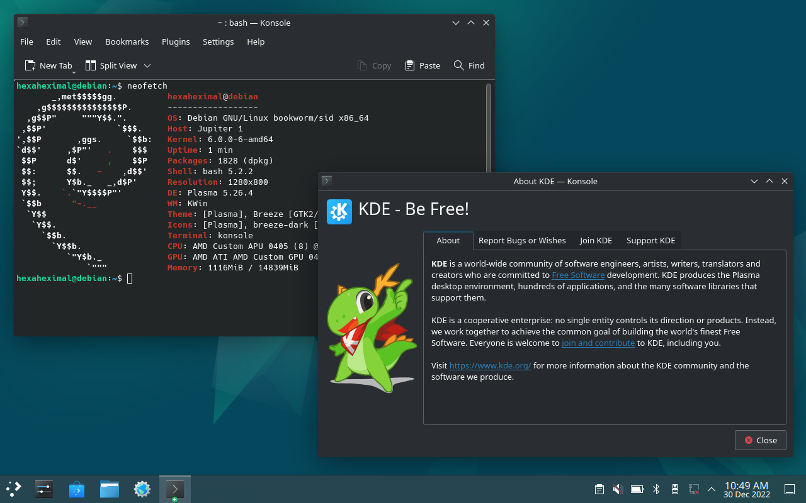

# deckian
[](https://matrix.to/#/#deckian:matrix.org)  

Dual-booting Debian on a Steam Deck, ***easily***.



## Why?

When I got my Steam Deck, I tried to dual-boot Debian stable on it with the official installer.

However, the installer was stretched (and in the incorrect rotation!) and it didn't look like it was going to work.

I eventually tried installing Ubuntu on it, and most things were working correctly - But there was no sound, and I couldn't use the controller as an actual controller.

At that point, I decided to just make a script that can install Debian to an SD Card and automatically fix all of the driver issues I had with it.

## Installation

After cloning this repository, run the following to install deckian to `/dev/sda` with the username `user` (change it to the correct values for your use case first!):
```
sudo python3 -m deckian bootstrap
sudo python3 -m deckian install-desktop plasma
sudo python3 -m deckian push deckian-plasma
sudo python3 -m deckian install deckian-plasma /dev/sda --username=user
```

## Credits

@iam_tj:matrix.org: Converted the spi-amd kernel module into a dkms module

## Known issues

- The built-in speaker does not work
- GNOME (and even gdm) crashes
- XFCE doesn't have a way to disable wireless (as a solution for this problem, I've added rfkill to the list of packages installed by `deckian bootstrap`)

## Features

Feature | Works? | Notes
|:--|:--|:--
| Display | Yes | Display rotation is broken, but `deckian install-desktop` handles that automatically.
| Wireless | Yes | On XFCE, you can't turn off wireless. However, you can turn it off with `rfkill`.
| Audio | Partially | HDMI audio works automatically. You will need to run `audiofix` before headphone audio works, and the built-in speaker currently does not work at all.
| Controller | No | The Steam Deck controller simulates a keyboard and mouse by default. Disabling that and using it as an actual controller does not work yet.

## Desktop environments

Desktop Environment | Works? | Notes
|:--|:--|:--
| KDE Plasma | Yes | KDE Plasma currently is the best DE choice for deckian, everything works really well.
| XFCE | Yes | Wireless cannot be disabled with the GUI, but everything else works.
| GNOME | No | GNOME crashes when it tries to load gdm.
